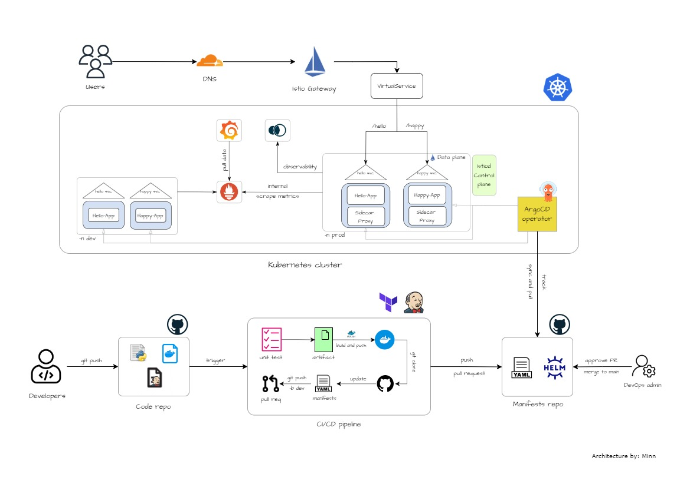

# Manifests repository for ArgoCD applications 

This repository is related to <a href="https://github.com/YU88John/k8s-gitops-code-repo">Microservices with CI/CD, GitOps, and Service Mesh</a> project.

## Architecture overview

## Repository Hierachy

- `/manifests`: Kubernetes manifest files for ArgoCD 
- `/service-mesh`: Istio, Grafana, and cluster configurations 

> DISCLAIMER: 
> Some parts of the project maybe misinterpreted. Any contribution is welcomed.